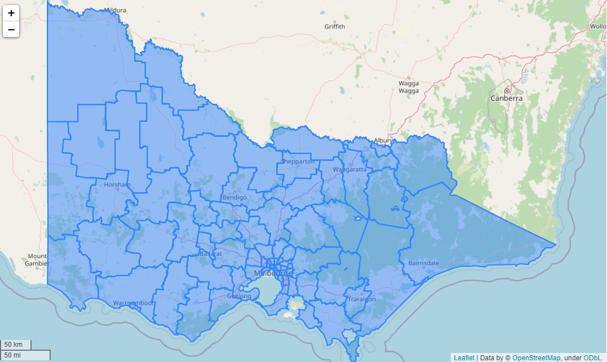

# VICTORIA CRIME STATISTIC

## Questions to be answered
1. Compare offence by types – What is top offence types within last 10 years?
2. What is the trend of crime types over months/years?
3. Top crime types by regions, what is the concentration of crime per regions?
4. What is the correlation between number of police station and number of crimes/offence status?

## Methodologies
We were allocted four teams members to our project group.
Together we searched publically available data sets and choose recent "Victorian crime statistics" for data analysis.
Finalysing about 4 questions, we performed an initial analysis on this data using advanced excel techniques. 
We set about interrogating this data using python code in Jupyter Notebook. 
We utilised a number of modules including python, numpy, scipys, pandas, geopandas, matplotlib and API's.
We created a repository on Github and utilised branches to write our own code.
We then merged each branch code into the main repository.

## Findings

Our main repository includes our [program code](Scripts/)

Answers to the forementioned questions are documented in [report](Write up or report.docx)

For summary of finding, please refer to [PowerPoint Presentation](Crime Victoria PowerPoint Presentation.pptx)

## Getting additional information

We obtained additional information for analysis:

- Latitude of police stations from [government data source](https://data.gov.au/dataset/ds-aurin-aurin%3Adatasource-VIC_Govt_DELWP-VIC_Govt_DELWP_datavic_VMFEAT_POLICE_STATION/distribution/dist-aurin-aurin%3Adatasource-VIC_Govt_DELWP-VIC_Govt_DELWP_datavic_VMFEAT_POLICE_STATION-0/details?q=), converted this to [geojson file](../DATA/VMFEAT_POLICE_STATION.json) and [csv file](../DATA/VMFEAT_POLICE_STATION.csv)  using [mapshaper](https://mapshaper.org/)

- LGA boundaries from [government data source](https://data.gov.au/dataset/ds-dga-bdf92691-c6fe-42b9-a0e2-a4cd716fa811/distribution/dist-dga-ce0a0ed3-6003-47fd-88ad-4b49d9337d47/details?q=), we saved this file in [here](../DATA/LGA_boundaries.json)

## Installation of dependencies - geopandas:

>Installing extention Geopandas is required to plot geographical information, which is sometimes tricky and time consuming, 
>⦁ Go to Unofficial Windows Binaries for Python Extension Packages. (https://www.lfd.uci.edu/~gohlke/pythonlibs/)
>⦁ Download the following binaries in a specifi folder in your laptop/PC: GDAL, Pyproj, Fiona, Shapely & Geopandas

>matching the version of Python, and whether the 32-bit or 64-bit OS is installed on your laptop. (E.g. for Python v3.8x (64-bit), GDAL package should be GDAL-3.3.2-cp38-cp38-win_amd64.whl)

>Go to the folder where the binaries are downloaded in the command prompt window. (C:\Users\abc\GeoPandas dependencies) Order of execution of the following commands matter.

>pip install .\GDAL-3.3.2-cp38-cp38-win_amd64.whl
>pip install .\pyproj-3.2.0-cp38-cp38-win_amd64.whl
>pip install .\Fiona-1.8.20-cp38-cp38-win_amd64.whl
>pip install .\Shapely-1.7.1-cp38-cp38-win_amd64.whl
>pip install .\geopandas-0.9.0-py3-none-any.whl

***Credits to mpriya from [stackoverflow](https://stackoverflow.com/questions/41009215/importerror-no-module-named-geopandas)***

# Glossary
#### Charge status ####
>The charge status indicates when a charge has been laid by Victoria Police at the time these data were extracted from the LEAP database. CSA output categories for this variable include:

>- Charges Laid,
>- No Charges Laid,
>- Unsolved

>In the event that no charges have been recorded the investigation status determines whether the incident is categorised as ‘unsolved’ or ‘no charges laid’. The ‘no charges laid’ category represents all investigation statuses other than ‘unsolved’. Both charge and investigation statuses represent information at a point in time and are subject to change.

#### Investigation status:
>indicates how the offences has been dealt with by Victoria Police at the time data was extracted from the LEAP database. This status represents information at a point in time and is subject to change.
CSA output categories include:

>- Arrest/Summons
>- Caution/Official warning
>- Intent to Summons
>- Other
>- Unsolved
>- Other includes: Penalty infringement notice, caution not authorised, complaint withdrawn, notice to appear, no offence disclosed, not authorised, offender processed, warrant issued, summons not authorised, presentment and other statuses.

For more [Glossary](https://www.crimestatistics.vic.gov.au/about-the-data/glossary-and-data-dictionary)***

